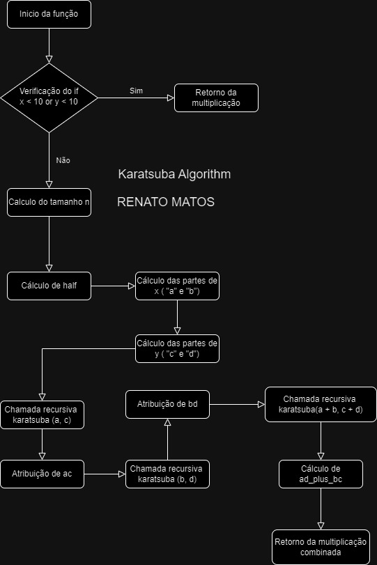

# Relatório Técnico Karatsuba
## Sobre o projeto
Trabalho realizado para a disciplina de FPAA (Fundamentos de Projeto e Análise de Algoritmos) do curso de Engenharia de Software (PUC Minas). O objetivo do trabalho é implementar o algoritmo de multiplicação de inteiros Karatsuba e realizar uma análise de complexidade do mesmo.

## Algoritmo de Karatsuba

O algoritmo de Karatsuba é uma técnica eficiente para multiplicação de números
inteiros grandes, introduzida por Anatolii Karatsuba em 1960. Ele melhora a
complexidade da multiplicação em comparação ao método tradicional de
multiplicação direta.

### Explicação linha a linha do código

```python
def karatsuba(x: int, y: int) -> int:
 if x < 10 or y < 10:
     return x * y
 else:
    n = max(len(str(x)), len(str(y)))
    half = n // 2
    a = x // (10 ** (half)) # A = parte a esquerda de x
    b= x % (10 ** (half)) # B = parte a direita de x
    c = y // (10 ** (half)) # C = parte a esquerda de y
    d = y % (10 ** (half)) # D = parte a direita de y
    ac = karatsuba(a, c)
    bd = karatsuba(b, d)
    ad_plus_bc = karatsuba(a + b, c + d) - ac - bd
    return ac * (10 ** (2 * half)) + (ad_plus_bc * (10 ** half)) + bd   
```


## Como execurtar o projeto


## Relatório Técnico

### Análise de Complexidade Ciclomática

#### O que é Complexidade Ciclomática?

A complexidade ciclomática é uma métrica usada para medir a complexidade do fluxo de controle de um programa. Ela calcula o número de caminhos independentes no código, considerando estruturas como loops (`for`, `while`) e condicionais (`if`, `try/except`). Quanto maior o valor, mais complexo é o código.

**Fórmula:**  
\(
M = E - N + 2P
\)  

Onde:  
- \(M\): Complexidade Ciclomática  
- \(E\): Número de arestas (transições) no grafo do controle de fluxo  
- \(N\): Número de nós (blocos de código)  
- \(P\): Componentes conectados (geralmente 1 para programas simples)  

#### Cálculo da Complexidade Ciclomática

Com isto explicado podemos partir para o calculo da complexidade ciclomática do algoritmo de Karatsuba. Para isso, vamos considerar o código do algoritmo como um grafo de controle de fluxo, onde os nós são os blocos de código e as arestas são as transições entre eles.

**N - Nós:**
1. Inicio da função
2. Verificação do `if`
3. Execução dentro do If (Retorno da multiplicação)
4. Cálculo do tamanho `n`
5. Cálculo de `half`
6. Cálculo das partes de `x` (`a` e `b`)
7. Cálculo das partes de `y` (`c` e `d`)
8. Chamada recursiva `karatsuba(a, c)`
9. Atribuição de `ac`
10. Chamada recursiva `karatsuba(b, d)`
11. Atribuição de `bd`
10. Chamada recursiva `karatsuba(a + b, c + d)`
11. Cálculo de `ad_plus_bc`
12. Retorno da multiplicação combinada

**E - Arestas:**
1. Início da função → Verificação do `if`
2. `if` verdadeiro → Retorno direto da multiplicação
3. `if` falso → Cálculo do tamanho `n`
4. Cálculo do tamanho `n` → Cálculo de `half`
5. Cálculo de `half` → Cálculo das partes de `x`
6. Cálculo das partes de `x` → Cálculo das partes de `y`
7. Cálculo das partes de `y` → Chamada `karatsuba(a, c)`
8. Chamada `karatsuba(a, c)` → Atibuição de `ac`
9. Atribuição de ac → Chamada `karatsuba(b, d)`
10. Chamada `karatsuba(b, d)` → Atribuição de `bd`
11. Atribuição de `bd` → Chamada `karatsuba(a + b, c + d)`
12. Chamada `karatsuba(a + b, c + d)` → Cálculo de `ad_plus_bc`
13. Cálculo de `ad_plus_bc` → Retorno da multiplicação combinada


Podendo ser melhor representado pela imagem a seguir do grafo de fluxo.



**Aplicando a Fórmula:**

Usando a fórmula da complexidade ciclomática:
\(
M = E - N + 2P
\)
Onde:
- \( E = 13 \) (arestas)
- \( N = 12 \) (nós)
- \( P = 1 \) (um único componente conectado)

\(
M = 13 - 12 + 2(1) = 3
\)

### Análise de Complexidade Assintótica

#### Analise de Complexidade de Tempo

#### Analise de Complexidade de Espaço


